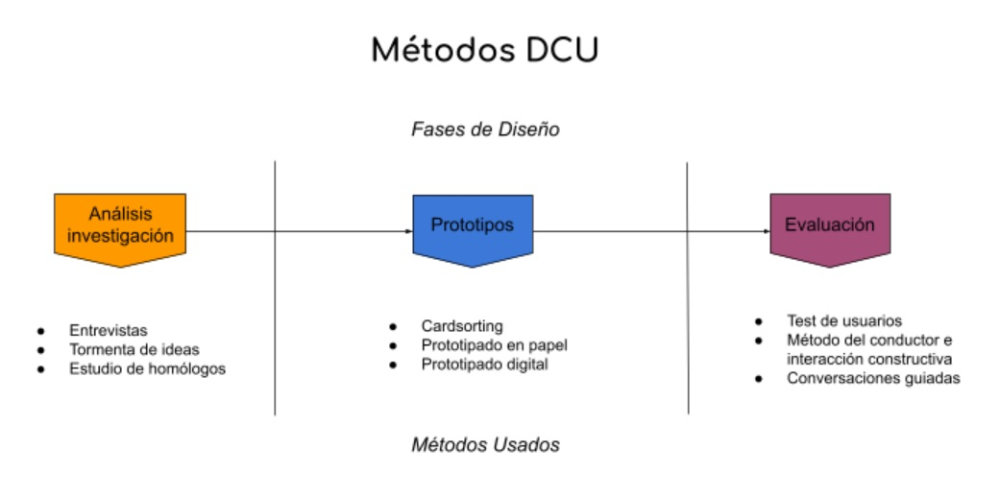
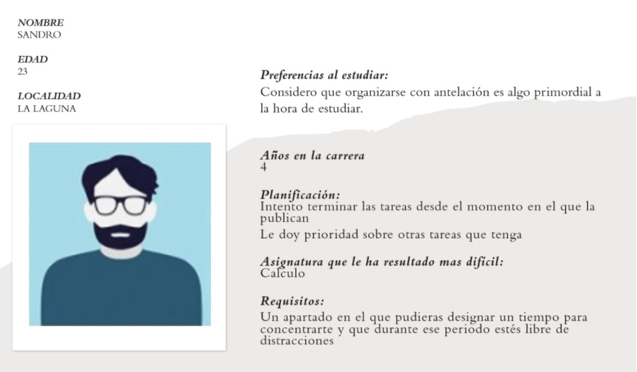
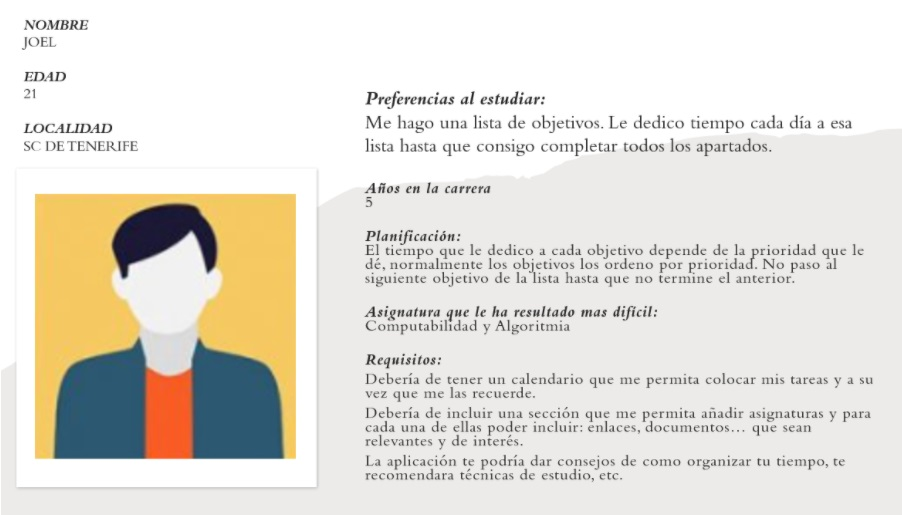
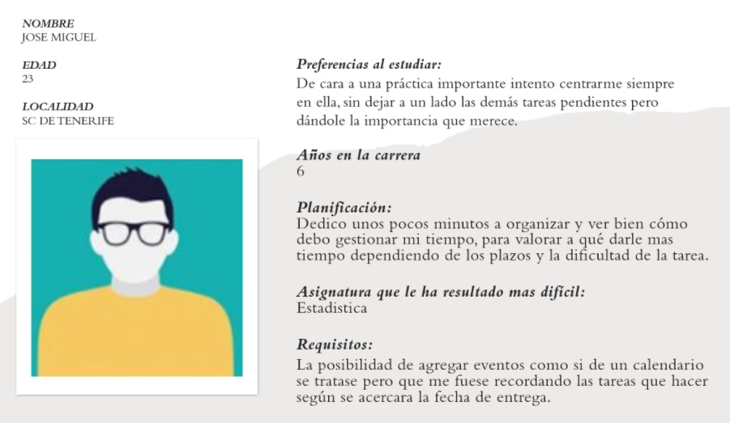
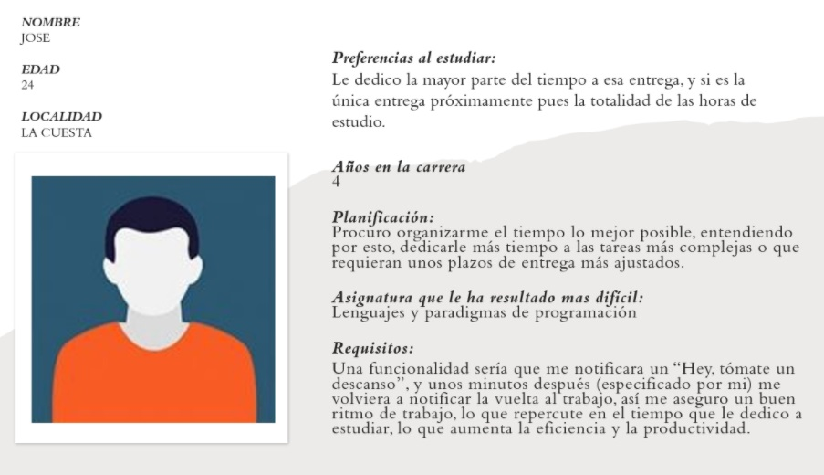

# USABILIDAD-Y-ACCESIBILIDAD
Repositorio del grupo 5 para la asignatura UYA.

En este fichero se describirán todos los pasos que hemos dado para llevar a cabo este proyecto:

## **1. Indicar en el documento del ejemplo de aplicación del DCU, qué actividades se corresponden con el diagrama de Métodos DCU y en qué fase del diseño se ubica.** 

A lo largo del documento se nos cuenta la experiencia de la creación de un portal bibliotecario con el uso del Diseño Centrado en el Usuario.

Durante la etapa de investigación hicieron uso de la entrevista, la cual fue la primera técnica, se aplicó a los clientes directos que solicitaron el proyecto e identificaron los primeros requisitos funcionales y no funcionales del proyecto.

Aplicaron una tormenta de ideas con todos los especialistas y técnicos de la biblioteca para identificar nuevos requerimientos y necesidades coincidentes.

Continuaron con un estudio de homólogos para realizar comparaciones entre sitios con objetivos, contenidos y público similar. A partir de usar esta técnica se hicieron un conteo de las etiquetas coincidentes sintácticas y semánticamente para facilitar la organización del contenido.

Empezando con la fase de prototipado se realizó el Card Sorting. Técnica para pulir la primera aproximación del mapa taxonómico, en concreto se utilizó el Card Sorting cerrado.

Una vez organizados los contenidos se procedió con el prototipado en papel, se realizaron bocetos sobre la estructura aproximada del sitio; cómo van a estar distribuidos los contenidos y la representación lógica de navegación para el usuario.

Por último se usó el prototipado digital, se empezaron a crear prototipos no funcionales del sitio, siendo bastantes importantes puesto que en ellos se refleja la realidad del proyecto aún sin implementar.

Así mismo, para la evaluación se podrían utilizar técnicas como la aplicación de Test de usuarios, estas técnicas se basan en la observación cómo un grupo de usuarios llevan a cabo una serie de tareas encomendadas por el evaluador, analizando los problemas con los que se encuentran.

También se utilizaría el método del Conductor e Interacción Constructiva, con las cuales de una forma u otra los usuarios expresan libremente sus pensamientos, sentimientos y opiniones sobre cualquier aspecto. O utilizar también conversaciones guiadas.

 
## **2. Aplicar el DCU para la realización de un prototipo de una aplicación web para la gestión y optimización del tiempo de estudio de un estudiante del Grado en Ingeniería Informática de la ULL. Para ello:**

### **Definir las tareas que se llevarán a cabo en la fase de investigación y diseño conceptual de la aplicación.**

#### **Análisis-Fase de investigación**

Primero, identificamos a los potenciales usuarios del sistema y saber que quieren hacer con él, para esto usamos el método de observación, ver cómo interactúan con su entorno y entender qué necesidades van teniendo con respecto con la ULL. Continuaremos realizando entrevistas y cuestionarios a cada usuario de manera individual para con esto crear perfiles de usuario y personas basados en los resultados de la investigación, con esto conseguiremos conocer en profundidad las percepciones, opiniones, deseos y emociones de las personas que usarían nuestra aplicación y reunir los requisitos necesarios. Las preguntas de la entrevista son:
 
¿Cómo organizas tu tiempo de cara a una entrega importante?
 
¿Si tienes un grupo de trabajo, cómo organizarías el trabajo y el tiempo del grupo?
 
¿Cuánto tiempo utilizas para organizar tu día a día, es decir tiempo para ti, tiempo para estudio, etc?
 
¿Que funciones u opciones te gustaría que tuvieran una app para la gestión y optimización del tiempo
 
¿Te gustaría que introdujera un sistema de objetivos de seguimiento y logros?
 
¿Podrías darnos, los que para ti, serían consejos para el correcto uso del tiempo en el estudio?
 
¿Cuánto tiempo llevas en la carrera?
 
¿Y cuál ha sido la asignatura que más te ha costado?
 
Asimismo, la encuesta realizada es la siguiente [Encuesta online](https://docs.google.com/forms/d/e/1FAIpQLSdsJ8iu0wr9ZrRjoIXy3oIdXLIGInXgzKxxv8UJ2ORBAWTHpQ/viewform) en formato Google Forms.

También realizamos un estudio de homólogos para así estudiar diferentes aplicaciones web de índole parecida, con objetivos, contenidos y público similar, para así llevar a cabo diversas comparaciones entre ellos. Entre las aplicaciones escogidas se encuentran la APP de la Universidad de La Laguna, las aplicación Wunderlist, Sesame, Trello, StayFocusd y Coach me.

Para terminar la fase de Análisis e Investigación y observando todos los requisitos puestos por los usuarios y a través del estudio de homólogos realizaremos una lluvia de ideas para aportar requisitos que no se hayan aportado aún o  soluciones a los requisitos.
 
#### **Diseño conceptual**

Una vez realizada la investigación, se puede empezar a crear los perfiles de usuario y la creación de personas. Identificamos por otro lado las tareas críticas que se quieren desarrollar en el software. Los perfiles de usuario nos permitirá seleccionar y describir las características de los usuarios, identificando para que grupos se está diseñando y encontrar personas que coincidan con el perfil que puedan apoyar los procesos de evaluación. La creación de personas nos permite crear arquetipos que modelan a los usuarios y tener claro sus opiniones y deseos para incorporar los requisitos que tendrá que satisfacer la aplicación.
 
### **Definir en el documento los personajes y perfiles de usuario que vayan a usar tu producto y la especificación de requisitos.**

#### **Perfiles de usuarios:**
 
##### **Estudiantes de ingeniería informática:**
 
**Contexto:** La aplicación de gestión y optimización debería ayudar al alumnado a organizarse de manera adaptada a las necesidades de la vida universitaria, por eso serían uno de sus principales usuarios de la plataforma. Es necesario que puedan usarla para organizar su tiempo de estudio, las entregas, tiempo libre, etc.
 
**Demografía:**  En el factor demográfico el grupo de estudiantes estaría compuesto en su mayoría por jóvenes de edades comprendidas entre los 18 y los 25 pero que pueden ser mayores.
 
**Destreza tecnológica:** Dentro de la media tienen una buena destreza tecnológica.
 
##### **Profesores de Ingeniería informática:**
 
**Contexto:** La aplicación de gestión y optimización debería ayudar al profesorado a organizarse con la asignatura que se encuentran impartiendo así cómo usarla para transmitirle las notificaciones al alumnado de la manera más óptima  y rápida posible. También para organizar sus propios proyectos y la realización de proyectos que posteriormente le dará a los alumnos, en general para la organización del tiempo de sus tareas
 
**Demografía:**  En el factor demográfico el grupo de profesores  estaría compuesto en su mayoría por adultos de edades comprendidas entre los 30 y los 65.
 
**Destreza tecnológica:** Dentro de la media tienen una buena destreza tecnológica.

#### **Perfiles de personas**

#### **Requisitos:**
Los requisitos reunidos en la fase de investigación son:
 
Un apartado en el que pudieras asignar un tiempo para concentrarte y que durante ese periodo estés libre de distracciones.
 
Tener un calendario para anotar las tareas y recordatorios.
 
Sección que permita añadir asignaturas y para cada una de ellas poder incluir: enlaces y documentos que sean relevantes y de interés.
 
Aportar consejos de como organizar tu tiempo, técnicas de estudio.
 
Notificaciones para tener un buen ritmo de trabajo, notifique los descansos y cuando volver a ponerse a trabajar.
 
Inclusión de un sistema de logros u objetivos.
 
Necesidad de ser escalable y modular.
 
Imagen y colores configurables para personas con daltonismo.
 
Carácteristicas cómo el tamaño de letra o la fuente adaptables a las necesidades del usuario.
 
Accesible a funciones por voz.